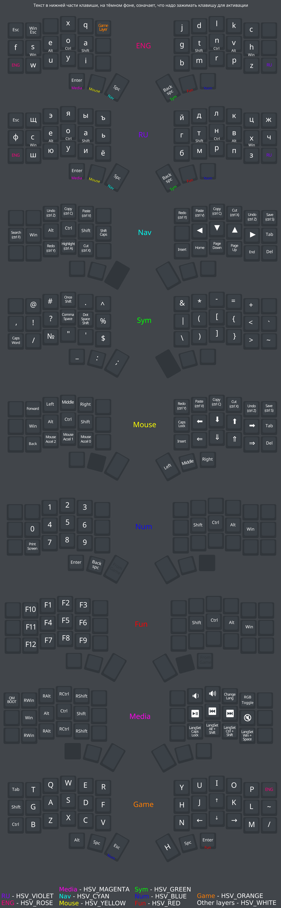

# TBK Mini

[Сайт](https://bastardkb.com/) и [гитхаб](https://github.com/Bastardkb/) разраба клавиатуры.


## Сборка и прошивка 

Для клавиатур на базе микроконтроллера `rp2040` команды для сборки и прошивки выглядят так:
```sh
make bastardkb/tbkmini/v2/splinky_3:seoa
```

```sh
qmk flash -kb bastardkb/tbkmini/v2/splinky_3 -km seoa
```

Выполнять их следует из корня репозитория виала.

После выполнения `qmk flash` нужно одновременно нажать 2 кнопки на микроконтроллере, либо 2 раза нажать кнопу `update`, если она уже распаяна на плате. Так прошивка будет залита на подключённый микроконтроллер.


## Требования

Эта прошивка занимает `~101.5 kb` так что нужно иметь контроллер с достаточным количеством памяти. Все контроллеры на базе `rp2040` не меньше `2 mb` памяти, так что из них можно взять любой.


## Описание

Автор оригинальной прошивки - [Buliway](https://github.com/Buliway)

В данной прошивке реализована кастомная фонетическая раскладка с большим количеством дополнительных кейкодов с разной функциональностью("умная" точка, капс на слово и тп). Часть "фишек" взята из репозитория [lang_shift](https://github.com/klavarog/lang_shift).

По дефолту стоит смена языка на капс, но это можно изменить под вашу систему в [config.h](./keymaps/seoa/config.h).

Подсветка в клавиатуре желательна. Она отвечает за цвет слоя, в котором вы сейчас находитесь.

В [./keymaps/seoa/img/](./keymaps/seoa/img/) лежит актуальная схема раскладки и файл для криты, если будет желание её редактировать 