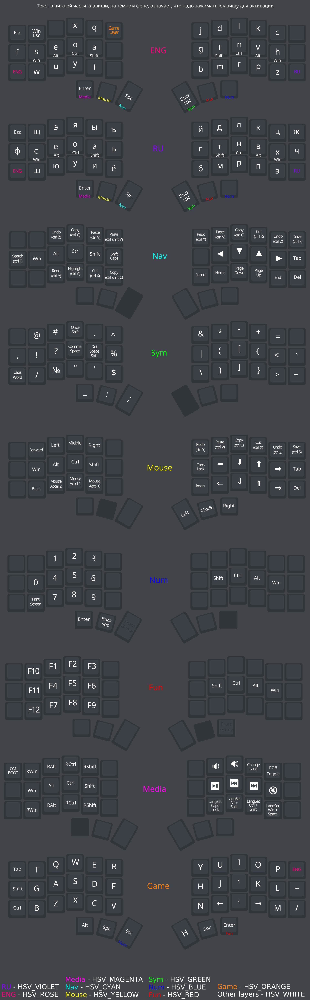

# TBK Mini

[Site](https://bastardkb.com/) and [github](https://github.com/Bastardkb/) of the author of this keyboard.


## Building and flashing

For keyboards based on `rp2040` comands for buinding and flashing looks like this:
```sh
make bastardkb/tbkmini/v2/splinky_3:seoa
```

```sh
qmk flash -kb bastardkb/tbkmini/v2/splinky_3 -km seoa
```

You shold use it in the root of the `vial` directory.

After using `qmk flash` you shold simultaneously press two buttons on the micro or twise press the `update` button if it was installed on plate already. After that you need to mount the `RPI-RP2`(or like this) device to your system and the firmware will be installed on your keyboard.


## Requirements

This firmware takes `~101.5 kb` of disk space so you need to use some micro that haue enough space for it. All cotrollers based on `rp2040` have at least `2 mb` of the disk space so you can use any of it.


## Description

The author of the original layout - [Buliway](https://github.com/Buliway)

Custom phonetic layout with many keycodes with different functionality("smart" dot, caps on one word etc.) were implemented in this firmware. Some "features" were added from [lang_shift](https://github.com/klavarog/lang_shift) repo.

By defaul it uses the `caps lock` key to change system language but you can change it like in your system in [config.h](./keymaps/seoa/config.h).

I suggest you to have RGB lightning in your keyboard. So it shows you which layer is active now.

In [./keymaps/seoa/img/](./keymaps/seoa/img/) you can see current layout scheme and file for krita so you can modify it 